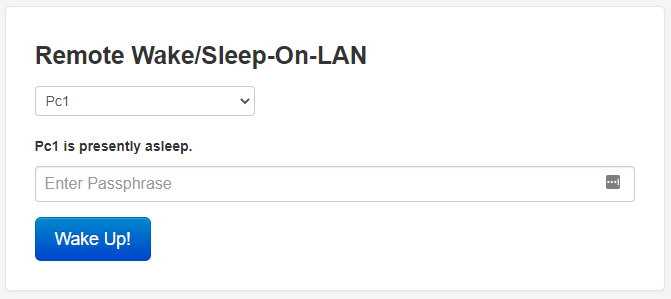

# Remote-Wake-Sleep-On-LAN-Docker
A docker image of [sciguy14/Remote-Wake-Sleep-On-LAN-Server](https://github.com/sciguy14/Remote-Wake-Sleep-On-LAN-Server)

> The Remote Wake/Sleep-on-LAN Server (RWSOLS) is a simple webapp that runs on Docker to remotely power up any computer via WOL. </br> This is necesarry, since WOL packages (Layer&nbsp;2) cannot be forwarded via a normal VPN (Layer&nbsp;3).



**Information:**
- You don't need any additinal software to wake your client via WOL.
- Additional software is needed to sleep/shutdown your client via this webinterface.

## Usage
Here are some example snippets to help you get started creating a container.

### docker-compose (recommended)
```
version: "3"

services:
  development-rwsols:
    image: ex0nuss/XXX
    container_name: frontend-rwsols
    restart: unless-stopped
    network_mode: host
    environment:
      - APACHE2_PORT=8080
      - PASSPHRASE=MyPassword
      - RWSOLS_COMPUTER_NAME="Pc1","Pc2"
      - RWSOLS_COMPUTER_MAC="XX:XX:XX:XX:XX:XX","XX:XX:XX:XX:XX:XX"
      - RWSOLS_COMPUTER_IP="192.168.1.45","192.168.1.50"
```

### docker CLI
``` 
docker run -d \
  --name=frontend-rwsols \
  --network="host" \
  -e APACHE2_PORT=8080 \
  -e PASSPHRASE=MyPassword \
  -e RWSOLS_COMPUTER_NAME="Pc1","Pc2" \
  -e RWSOLS_COMPUTER_MAC="XX:XX:XX:XX:XX:XX","XX:XX:XX:XX:XX:XX" \
  -e RWSOLS_COMPUTER_IP="192.168.1.45","192.168.1.50" \
  --restart unless-stopped \
  image: ex0nuss/XXX
```

## Parameters and environment variables
Container images are configured using parameters passed at runtime (such as those above). There is no config file needed.
Parameter / Env var | Optional | Default value | Description | 
------------ | ------------- | ------------- | -------------
`network_mode: host` | no | / | The container’s network stack is not isolated from the Docker host. This is necessary to send WOL packages from a container. The port of the webserver is configures via `APACHE2_PORT`.
`APACHE2_PORT` | yes | 8080 | Port of the webinterface.
`PASSPHRASE` | yes | admin | Password of the webinterface.
`RWSOLS_COMPUTER_NAME` | no | / | Displaynames for the computers (**array**)
`RWSOLS_COMPUTER_MAC` | no | / | MAC addresses for the computers (**array**)
`RWSOLS_COMPUTER_IP` | no | / | IP addresses for the computers (**array**)
`RWSOLS_SLEEP_PORT` | yes | 7760 | This is the Port being used by the Windows SleepOnLan Utility to initiate a Sleep State (**not necessary for WOL only**)
`RWSOLS_SLEEP_CMD` | yes | suspend | Command to be issued by the windows sleeponlan utility (**not necessary for WOL only**)

#### Explanation: Configuring the destination computer name, MAC and IP
To configure the computers we want to wake, we will you these three environment variables:
- `RWSOLS_COMPUTER_NAME`
- `RWSOLS_COMPUTER_MAC`
- `RWSOLS_COMPUTER_IP`

Let's say we want to wake 2 computer in the end with the following configurations:
1. PC1
   - Displayname: PC of Mark
   - MAC address: 24:00:dd:5a:21:04
   - IP address: 192.168.1.146
2. PC2
   - Displayname: PC of John
   - MAC address: 59:3c:45:3c:30:f6
   - IP address: 192.168.1.177

To configure the env vars it's easire to image it in a table:
>RWSOLS_COMPUTER_NAME | RWSOLS_COMPUTER_MAC | RWSOLS_COMPUTER_IP
>------------ | ------------- | -------------
>PC of Mark | 24:00:dd:5a:21:04 | 192.168.1.146
>PC of John | 59:3c:45:3c:30:f6 | 192.168.1.177

Now you just format the table in an array:
>```
>      - RWSOLS_COMPUTER_NAME="PC of Mark","PC of John"
>      - RWSOLS_COMPUTER_MAC="24:00:dd:5a:21:04","59:3c:45:3c:30:f6"
>      - RWSOLS_COMPUTER_IP="192.168.1.146","192.168.1.177"
>```
It's important to use the format as show above: `"XXX","XXX"`
